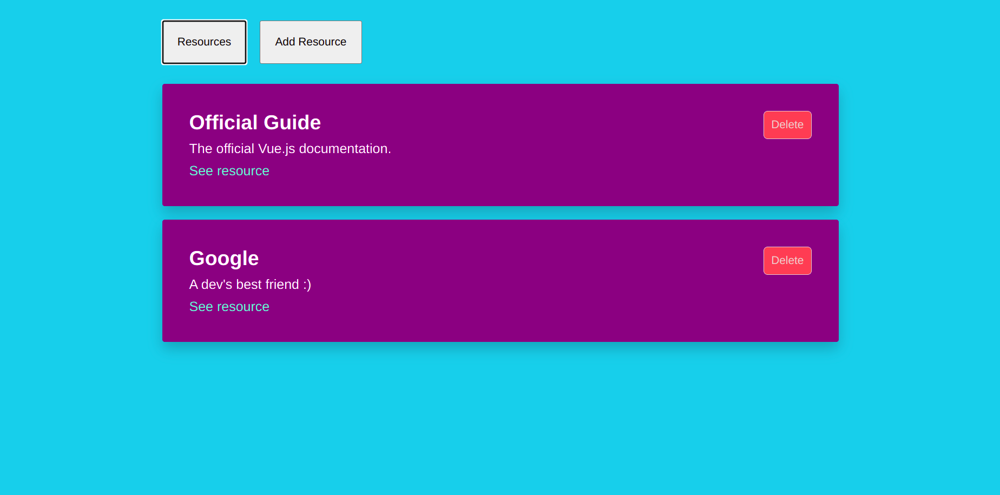

# RememberMe
## Contexto

Esta é uma simples aplicação feita para fins de estudo do framework Vue.js. 
Nela trabalho conceitos como: 
- Reatividade
- Gerenciamento de dados
- Props
- Eventos
- Validações de formulário

